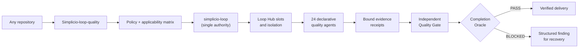
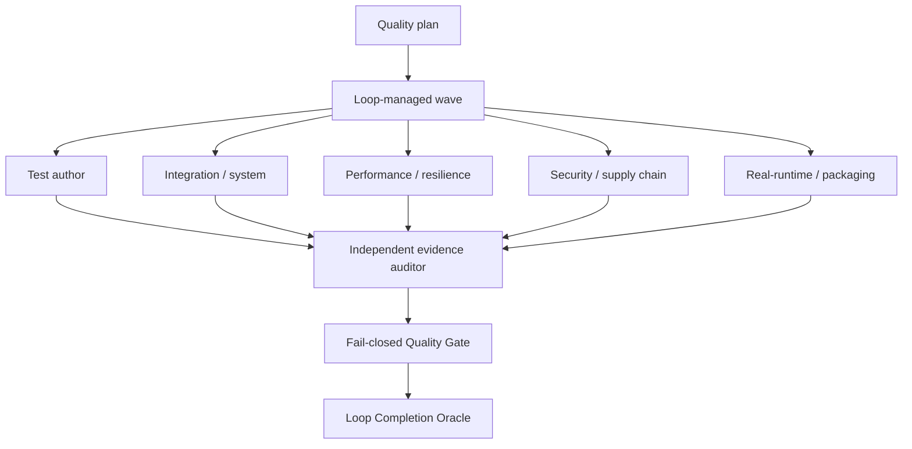

# 🛡️ Simplicio-loop-quality — Verified quality for any repository

<p align="center">
  
</p>

<p align="center">
  <strong>Agent-driven, fail-closed testing and quality assurance executed by <a href="https://github.com/wesleysimplicio/simplicio-loop">simplicio-loop</a>.</strong>
</p>

<p align="center">
  <a href="https://github.com/wesleysimplicio/simplicio-loop-quality/actions"></a>
  <a href="https://github.com/wesleysimplicio/simplicio-loop-quality/issues"></a>
  <a href="https://github.com/wesleysimplicio/simplicio-loop-quality/blob/master/src/simplicio_loop_quality/contracts/strict-default.json"></a>
  <a href="https://github.com/wesleysimplicio/simplicio-loop-quality/blob/master/src/simplicio_loop_quality/agents.py"></a>
  <a href="LICENSE"></a>
</p>

<p align="center">
  <a href="#-tldr">TL;DR</a> ·
  <a href="#-how-it-works">How it works</a> ·
  <a href="#-the-36-quality-lanes">36 lanes</a> ·
  <a href="#-run-it">Run it</a> ·
  <a href="#-star-history">Star history</a> ·
  <a href="#-contributing">Contributing</a>
</p>

<p align="center">
  <strong>🌍 Languages:</strong><br>
  <a href="README.md">🇬🇧 English</a> |
  <a href="READMEs/README.pt-BR.md">🇧🇷 Português</a> |
  <a href="READMEs/README.es-ES.md">🇪🇸 Español</a> |
  <a href="READMEs/README.fr-FR.md">🇫🇷 Français</a> |
  <a href="READMEs/README.de-DE.md">🇩🇪 Deutsch</a> |
  <a href="READMEs/README.it-IT.md">🇮🇹 Italiano</a> |
  <a href="READMEs/README.ja-JP.md">🇯🇵 日本語</a> |
  <a href="READMEs/README.ko-KR.md">🇰🇷 한국어</a> |
  <a href="READMEs/README.zh-CN.md">🇨🇳 简体中文</a> |
  <a href="READMEs/README.ru-RU.md">🇷🇺 Русский</a> |
  <a href="READMEs/README.pl-PL.md">🇵🇱 Polski</a> |
  <a href="READMEs/README.tr-TR.md">🇹🇷 Türkçe</a> |
  <a href="READMEs/README.nl-NL.md">🇳🇱 Nederlands</a> |
  <a href="READMEs/README.hi-IN.md">🇮🇳 हिन्दी</a> |
  <a href="READMEs/README.ar-SA.md">🇸🇦 العربية</a>
</p>

---

## 🚀 TL;DR

**Simplicio-loop-quality** is the quality extension for the Simplicio product line. It decides which
quality checks apply, supplies declarative testing agents, validates evidence, and hands the final
decision to the `simplicio-loop` Completion Oracle.

It is deliberately **not** a second orchestrator. The Loop remains the only owner of Hub slots,
queues, scheduling, isolation, processes, retries, recovery, delivery, and terminal completion.

### Project metadata

**Description:** **Simplicio-loop-quality** — agent-driven, fail-closed quality gates for any
repository via `simplicio-loop`.

**Topics:** `simplicio-loop-quality` · `simplicio-loop` · `testing` · `quality-assurance` ·
`quality-gates` · `test-automation` · `ai-agents` · `evidence-driven` · `fail-closed` ·
`software-verification`

> **Current status:** architectural bootstrap with a fail-closed gate. Production execution remains
> blocked until the required upstream Loop extension hooks are available.

## 🔭 How it works



<p align="center">
  
</p>

<p align="center"><em>Evidence is collected during the authoritative run, not written after the fact.</em></p>

The extension contributes policy, agents, adapters, plans, findings, evidence and gates. It never
creates a local scheduler, worker pool, process supervisor, worktree manager or alternative done
state.

## 🤖 Quality-agent constellation



<p align="center">
  
</p>

<p align="center"><em>Agents may author evidence; an independent auditor decides whether that evidence is admissible.</em></p>

## 🧪 The 36 quality lanes

The strict policy covers unit, component, integration, contract, system, end-to-end, regression,
smoke, real-runtime, negative-path, property, fuzz, mutation, invariant, concurrency,
fault-injection, repeatability, security, supply chain, performance, load/stress/soak, coverage,
compatibility, installation, upgrade/downgrade, migration, operational readiness, privacy,
documentation, observability, implementation completeness, code review, static quality and
evidence audit.

Applicability is explicit: an inapplicable lane needs a technical reason and independent approval.
Skipped, flaky, stale, missing or unverifiable evidence never becomes `PASS`. Missing metrics are
`null` with a machine-readable reason, never zero or an estimate.

## ▶️ Run it

```bash
pip install -e .

simplicio-loop-quality doctor
simplicio-loop-quality agents
simplicio-loop-quality plan --repo /path/to/project --out quality-task.md
simplicio-loop-quality run --repo /path/to/project
simplicio-loop-quality gate \
  --receipt quality-evidence.json \
  --source-sha "$LOOP_SOURCE_SHA" \
  --artifact-root "$LOOP_ARTIFACT_ROOT"
```

`run` starts exactly one authoritative Loop process after `doctor` proves the required extension
capabilities. The standalone `gate` command is diagnostic; authoritative completion requires the
Loop-ledger provenance and Completion Oracle.

## ⭐ Star history

Track the project as the quality layer matures:

[](https://www.star-history.com/#wesleysimplicio/simplicio-loop-quality&Date)

## 🧭 Scope boundary

Quality agents may create or improve tests, fixtures, test configuration, quality CI and evidence.
A product defect becomes a structured finding for the Loop recovery/implementation stage; this
extension does not implement unrelated product behavior.

See [Architecture](docs/ARCHITECTURE.md), [Quality contract](docs/QUALITY_CONTRACT.md), and the
[upstream requirements](docs/UPSTREAM_REQUIREMENTS.md).

## 🛠️ Development

```bash
python scripts/check.py
pytest --cov=simplicio_loop_quality --cov-branch --cov-fail-under=85
```

## 🤝 Contributing

Open an issue with a reproducible quality gap, the affected lane, evidence, and the expected
acceptance criteria. Changes must preserve the single-authority Loop boundary and the independent
evidence gate.

## License

MIT
